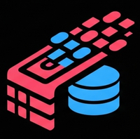

# RAG GitHub Actions

    

A collection of GitHub Actions that provide typical [Langchain](https://www.langchain.com/) RAG workflows such as content indexing, chunking and embedding. The resulting embeddings are then stored in [Supabase](https://supabase.com/) tables for retrieval and querying.

## Setup

Create a Supabase account and database and create required vector tables and functions using the provided [example SQL file](./supabase/setup.sql).

All workflows require the same base configuration, consisting of an OpenAI API Key, Supabase URL and API Key which should be created as GitHub secrets so they can be reused across multiple workflows.

## Ingestion

Markdown Directory Example:

    - name: Markdown Directory Ingestion
      uses: jinglemansweep/rag-actions/.github/actions/ingest-loader@main
      with:
        openai_api_key: ${{ secrets.OPENAI_API_KEY }}
        supabase_url: ${{ secrets.SUPABASE_URL }}
        supabase_key: ${{ secrets.SUPABASE_KEY }}
        supabase_table: ${{ vars.SUPABASE_TABLE }}
        metadata: |
          {
            "collection": "${{ vars.SUPABASE_COLLECTION }}",
            "github": {
              "run": "${{ github.run_id }}"
            }
          }
        args: |
          {
            "path": "./test/content/test",
            "glob": "**/*.md"
          }
        loader_class: "markdown"
        loader_args: '{}'
        chunker_class: "recursive_character"
        chunker_args: '{"chunk_size": 1000, "chunk_overlap": 200}'

RSS Feed Example:

      - name: RSS Feed Ingestion
        uses: jinglemansweep/rag-actions/.github/actions/ingest-loader@main
        with:
          openai_api_key: ${{ secrets.OPENAI_API_KEY }}
          supabase_url: ${{ secrets.SUPABASE_URL }}
          supabase_key: ${{ secrets.SUPABASE_KEY }}
          supabase_table: ${{ vars.SUPABASE_TABLE }}
          metadata: |
            {
              "collection": "${{ vars.SUPABASE_COLLECTION }}",
              "feed": "news",
              "source": "bbc"
            }
          loader_class: "rss"
          loader_args: |
            {
              "urls": [
                "https://feeds.bbci.co.uk/news/rss.xml"
              ]
            }
